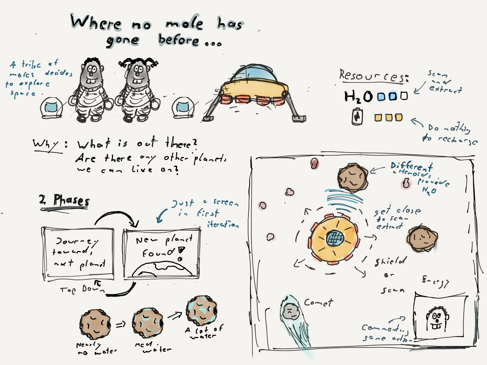

This is my entry for Ludum Dare 48 (Theme 'Deeper and deeper'). 
The game is about two moles exploring space with their ship. 
They neeed water to survive and keep the power supply up and running. 
How far will they get, how many planets will they find?

# What about a devlog?
After a brainstorming session, a good breakfast and a short walk, I was happy with one idea. 

