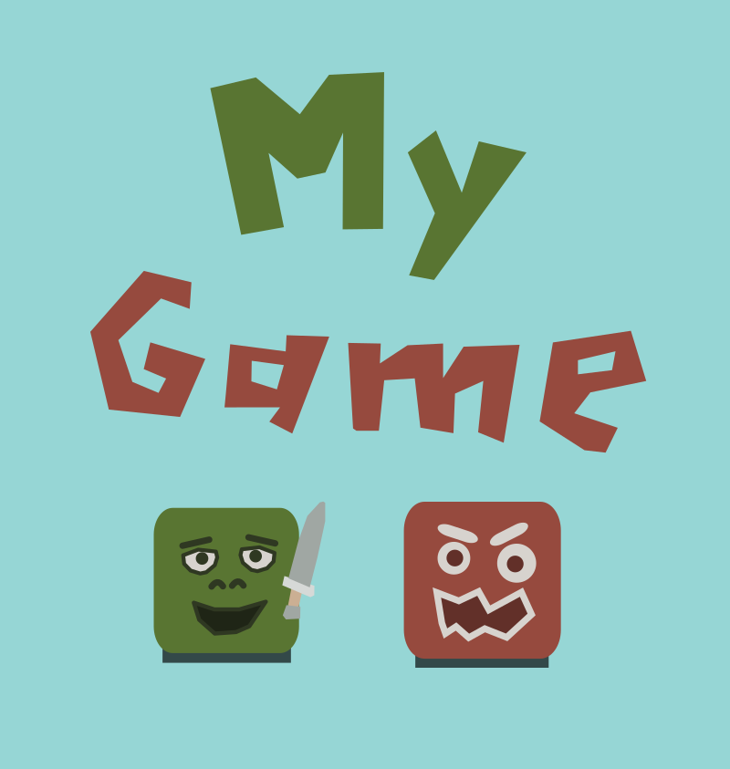
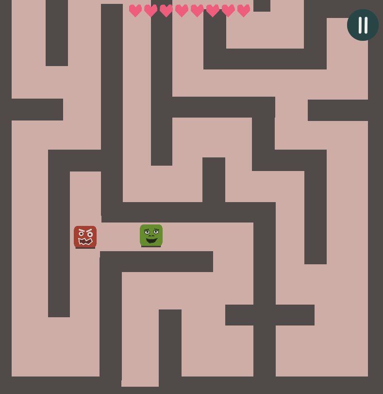

This is a starting point for a simple top-down game using Clayground.
Write here a short intro of your game. Don't be scared by the artistic
content of this template - it is just a starting point and created to be fully
replaced ;)

# Some more details
The game is about a guy fighting his way throw a maze.

# What about a devlog?
Describe what you have done how was the process of building the game - prefer using
images/screenshot over long descriptions.

And of course feel also free to suggest improvements for this template :)
