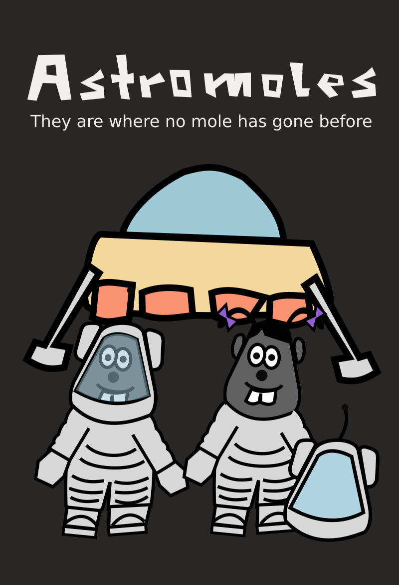
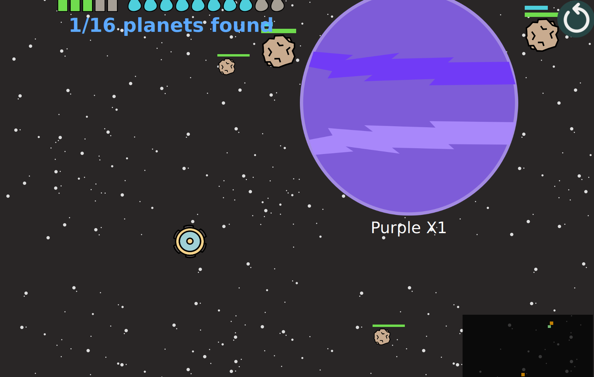
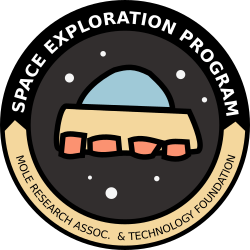
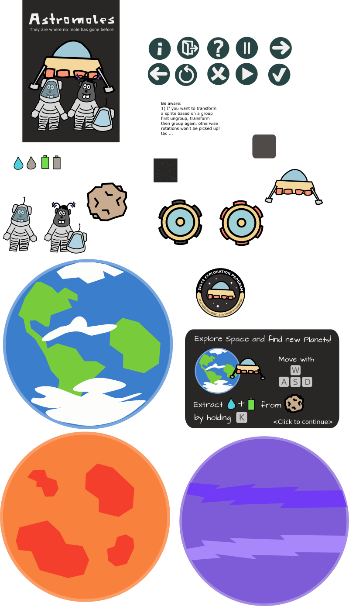
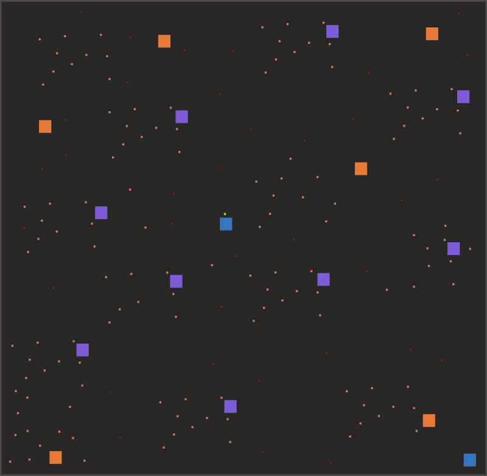

This is my entry for Ludum Dare 48 (Theme 'Deeper and deeper').
The game is about two moles exploring space with their ship.
They neeed water to survive and keep the power supply up and running.
How far will they get, how many planets will they find?

# Current state, improvements and missing features

Features of the game:
- Resources energy and H2O need to be kept up by mining them on asteriods
- Smaller fast moving asteriods need to be evaded
- Planets are distributed among space, you can colonize them and return to them to recharge
- See your results next to the 'Space Program Badge'

Some aspects I have intially planned didn't made it (sorted by prio):
- 'Fog of war' in the minimap to improve exploration experience
- Starship-like movement with inertia and bouncing
- Special effects for mining and finding new planets
- Story intro - space ship lifting off the home planet and telling some words about the mission
- Ending based on how many planets you have found 
- Comments by the moles for some events
- Make controls configurable (Enable Gamepad) 
- More planets (maybe even procedural), providing different recharging rates

# Some development insides 
After a brainstorming session, a good breakfast and a short walk, I was happy with one idea. 

Foundation for the implementation is a combination of basic [Qt Framework](https://qt.io) usage and the application 
of [Clayground](https://github.com/MisterGC/clayground.git), a tool to rapidly develop small application with C++, Qml and JavaScript. 

I have used Inkscape to create all the visuals. As [Clayground](https://github.com/MisterGC/clayground.git) allows to use parts 
of a SVG as sprites, I could put all visuals in one SVG.

I created the map in two iterations - first I used quite a small one to test the basic mechanics, 
then I inreased it significantly to get the 'space feeling' right/better.

The big squares are planets, the medium sized ones are slowly moving asteriods, the tiny small ones represent fast-moving asteriods.
The player start position is defined by the square next to the blue planet in the center.

Music, voice acting and sound effects have been done with a combination of Garage Band (iOS version) and Audacity.

Do you have questions or remarks? Or do you want to make this small game better?
Just contact me, write an issue or create a Pull Request. 

Enjoy life, mgc
